## Этап 1. Исследовательский анализ (EDA)

### Анализ качества данных 

1. Провел разведочный анализ, проверил соответствие масок для исходных изображений и визуализировал их.

2. Просмотрел изображения и маски в test. Неточностей по размещение масок обнаружено не было.

В train были обнаружены плохие маски в файлах:
    train/000000023731_404.jpg
    train/000000028253_7169.jpg
    train/000000049758_3963.jpg
    train/000000066011_2187.jpg
    train/000000121530_5761.jpg
    train/000000247301_4455.jpg
    train/000000258305_3996.jpg
    train/000000275028_3168.jpg
    train/000000275919_4499.jpg
    train/000000317781_4461.jpg
    train/000000419618_7033.jpg
    train/000000481212_908.jpg
    train/000000562835_2386.jpg
    train/000000574769_0.jpg

В valid проблем не обнаружено.

| Исходное изображение | Изначальная маска | Исправленная маска | Комментарий |
| :---: | :---: | :---: | :---: |
| 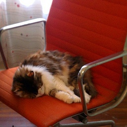 | 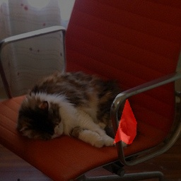 | 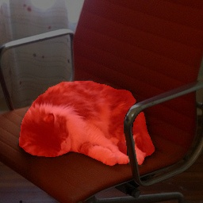 | Часть маски была утеряна |
| 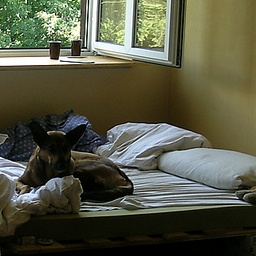 | 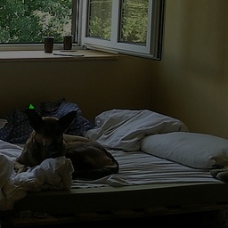 | 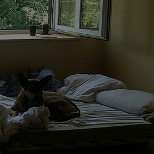 | Отсутствие маски |
| 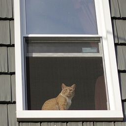 | 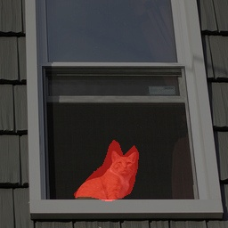 | 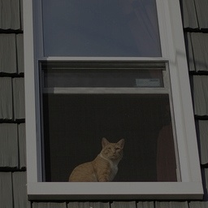 | Неточная маска |
|  | 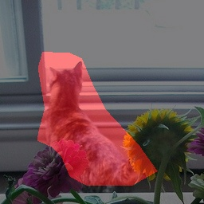 |  | Неточная маска |
| 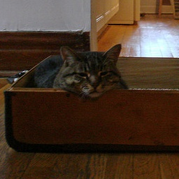 | 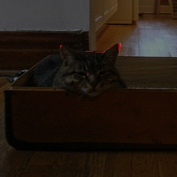 | 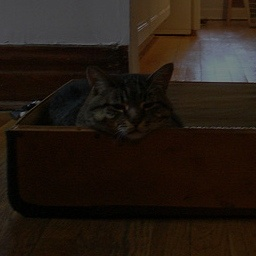 | Отсутствие маски |
| 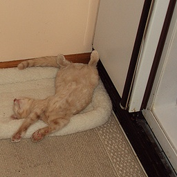 | 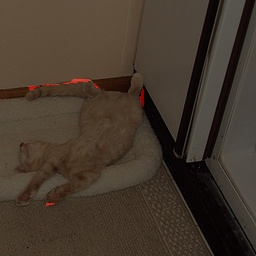 | 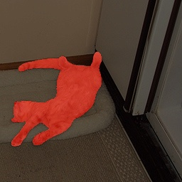 | Отсутствие маски |
| 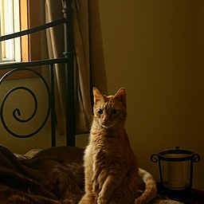 | 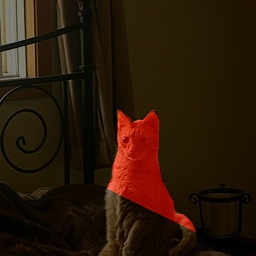 | 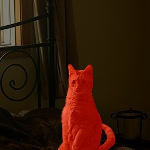 | Часть маски была утеряна |
| 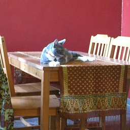 | 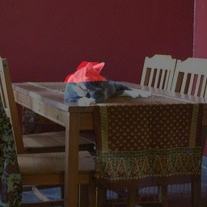 | 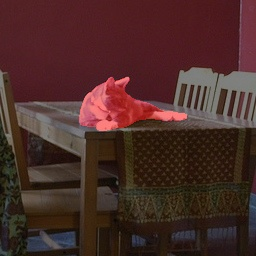 | Часть маски была утеряна |
| 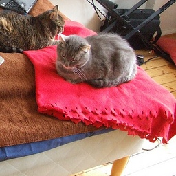 | 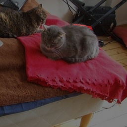 | 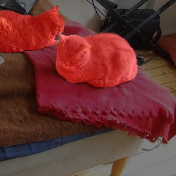 | Отсутствие маски |
| 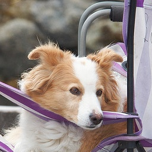 | 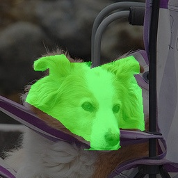 | 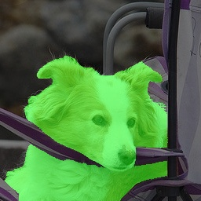 | Часть маски была утеряна |
| 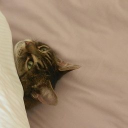 | 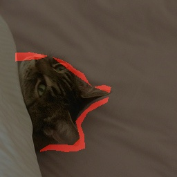 | 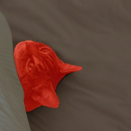 | Часть маски была утеряна |
| 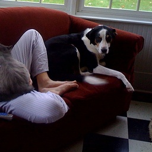 | 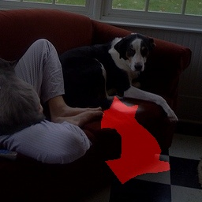 | 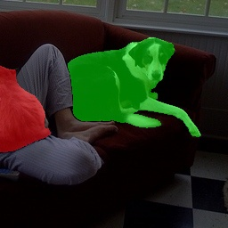 | Неточная маска |
| 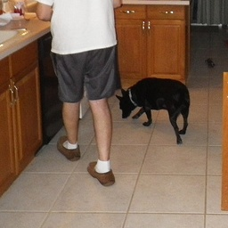 | 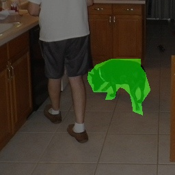 | 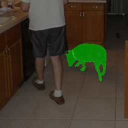 | Неточная маска |
|  |  | 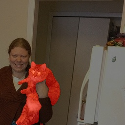 | Отсутствие маски |

### EDA

Опишите свои работы по EDA, приложите артефакты (графики и/или Jupyter Notebook)