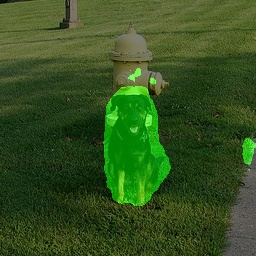
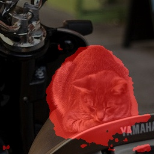
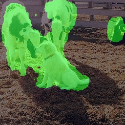
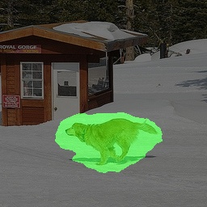

## Этап 2. Формирование первичных гипотез

### Стартовая гипотеза 1: Baseline-модель на архитектуре DeepLabv3+

**Описание гипотезы**  

* **Архитектура и Backbone:** В качестве базового решения (baseline) выбрана архитектура **DeepLabv3+** с энкодером **ResNet-50** (предобученным на ImageNet). Выбор обоснован способностью модуля ASPP (Atrous Spatial Pyramid Pooling) эффективно агрегировать контекст и выделять объекты разного масштаба. Декодер DeepLabv3+ позволяет точнее восстанавливать резкие границы объектов, что критично для сегментации силуэтов животных (контуры шерсти, лап, ушей).
* **Функция потерь (Loss):** Используется комбинированная функция потерь Dice Loss + Weighted Cross Entropy Loss
* **Аугментации данных:**
  * `Resize`
  * `RandomFlip`
  * `PhotoMetricDistortion`
  * `RandomResize`
  * `RandomRotate`
  * `RandomCrop`

**Результаты обучения**  

* [Ссылка на конфигурационный файл гипотезы 1](../../practicum_work/artifacts/deeplabv3_baseline/baseline.py)  
* [Ссылка на эксперимент в ClearML](https://app.clear.ml/projects/82b447a13dfd4bc0ac9dfb5f93ff85b2/experiments/b016ec30568c4939aba0c8c8bfb4ebc7/output/execution)
* [Ссылка на эксперимент в ClearML](https://app.clear.ml/projects/82b447a13dfd4bc0ac9dfb5f93ff85b2/experiments/fa85c9725f4f41e196d3cf00d81b7007/output/execution)  

Метрика mDice в ClearML не показывает реальные результаты, так как в коде была допущена ошибка.

**Анализ качества**  

#### Метрики на валидационной выборке
* **Mean IoU (mIoU):** `67.0200`
* **Dice Score (F1):** `78.8000`
* **Pixel Accuracy:** `91.9700`

#### Примеры правильной работы модели (Success Cases)

#### Анализ ошибок модели (Fail Cases)

Как видно, из работы основные проблемы модели это точно опредить границы объектов, а также у модели возникают проблемы с сегментацией объектов на изображениях имеющих несколько объектов. 
* [Ссылка на эксперимент в ClearML](https://app.clear.ml/projects/82b447a13dfd4bc0ac9dfb5f93ff85b2/experiments/4b948badd11f459f88df9d275c1041b1/output/execution)
