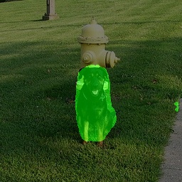
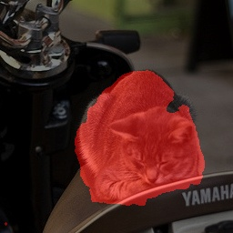
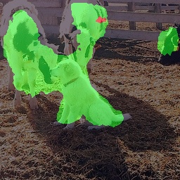
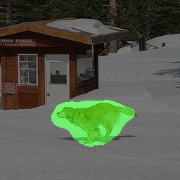

## Этап 3. Эксперименты по улучшению качества

### Эксперимент 1 

**Описание эксперимента**

Эксперимент будет направлен на дообучение модели с целью исправления проблем определения границ объектов.
Для этого снижу вес CrossEntropy. 

**Результаты обучения**

* [Ссылка на конфигурационный файл](../../practicum_work/artifacts/deeplabv3_experiment1/20260621_160943/vis_data/config.py)  
* [Ссылка на эксперимент в ClearML](https://app.clear.ml/projects/82b447a13dfd4bc0ac9dfb5f93ff85b2/experiments/d18a6528b9434270aa257fc9e8236f2a/output/execution)

**Анализ качества**  

#### Метрики на валидационной выборке
* **Mean IoU (mIoU):** `74.8100`
* **Dice Score (F1):** `84.7300`
* **Pixel Accuracy:** `95.4700`

#### Примеры правильной работы модели (Success Cases)

#### Анализ ошибок модели (Fail Cases)

